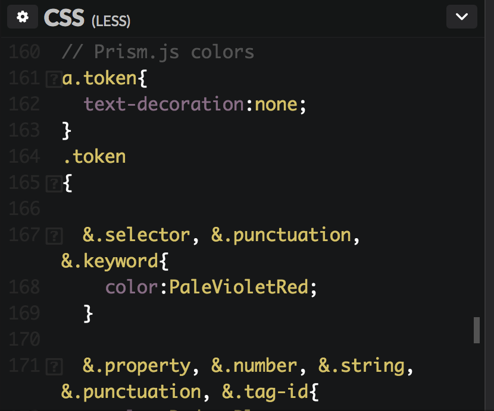
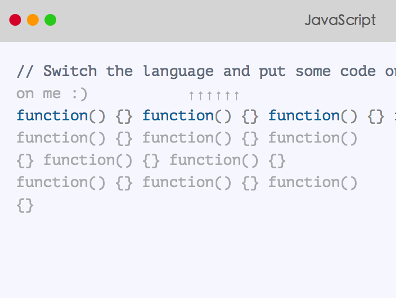
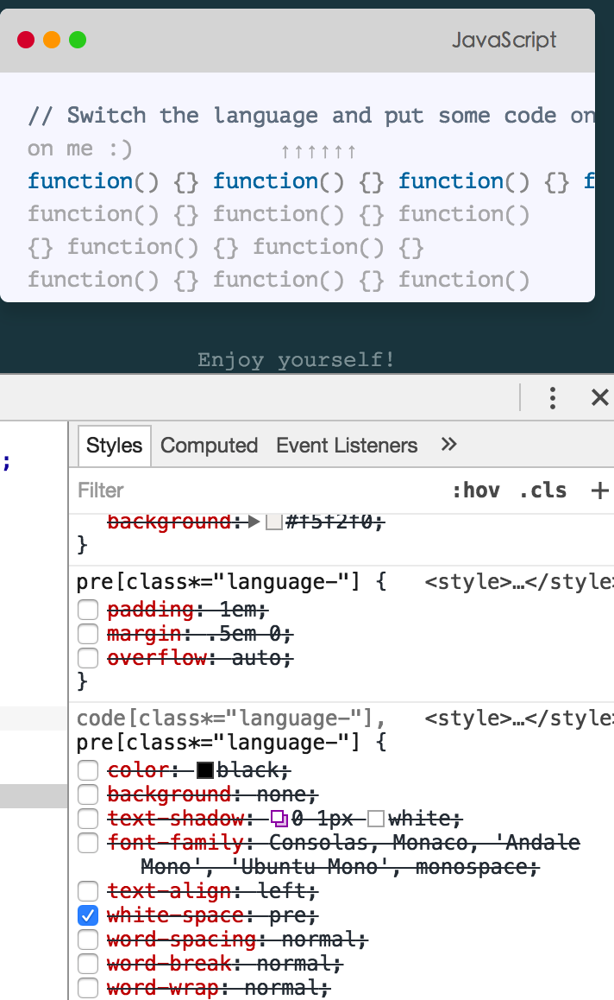
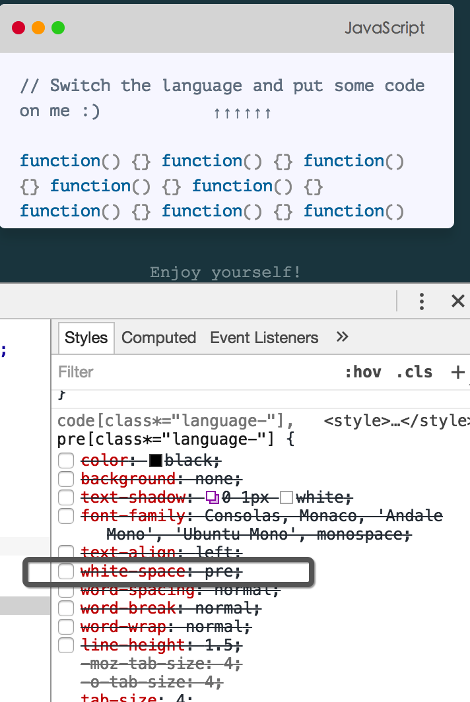

##Build Setup
##总结
##toolBox
###scale
// const originaldata = el.getBBox(); //getBBox()值初始化后，永远不会变（要不scale怎么能用)

##pointLink
###vue watch
vue watch 一个 this.test.a.b.c, 如果this.test本身没有增删，是不会触发相关watch回调函数的

换句话说，$watch不会单独监控this.test中的各个对象，只有当this.test/this.test.a/.b.c等被直接赋值时才会启动。

```
                    vm.$watch(function() {
                        this.eventHappenedNum;
                        return this.linkData[endIndex].startRoot.attributes.transform.value;
                    }, function() {
                        let box = V(el).bbox();
                        dataSet[endIndex].start.x = box.x;
                        dataSet[endIndex].start.y = box.y;
                    })
```
>上述代码加入了this.eventHappenedNum以捕捉事件，启动watch,watch启动后，会检测this.eventHappenedNum(肯定变了），再检测this.linkData[..].....(this.linkData中绑定的DOM对象变更虽然改变了transoform.value值，但如上面说过的，没有直接操作this.linkData或其属性，所以watch不会启动。)

```
            this.$watch(() => {
                this.eventHappenedNum;
                return this.root(data.startEl).attributes.transform.value;
            }, function() {
                const box = V(data.startEl).bbox();
                data.start.x = box.x;
                data.start.y = box.y;
            })
```
** this.eventHappenedNum与this.root(da...)...值变更 决定了 watch 检测是否开启，

return 返回值是否改变，决定了回调函数是否执行（const box.....)

所以 return this.eventHappenedNum + this.root.... 会一直触发回调函数
**

##translateTheRoot实现嵌套
el.children 就是nodelist结构（伪数组），可以直接Array.prototype.slice.call(el.children)转化过来。（不转化，遍历时自然length等用不到的属性也会出来）

##prism 三方库使用 出现的问题
使用<style scoped>，必须在当前文件内将 dom树（<template></template>）写好。

<style scoped>形成的'css规则树'只在 当前元素生成 渲染树时有用，即便之后创建元素后挂载在<template></template>根元素中，<style scoped>的css也不起作用。

**字符对不上原因出在，我用prism官网的css替换了 codepen 上人家本身的配色方案。




> 最后，通过注释掉了官网css中的一句话，避免了字符错位。（没有用codepen原本的less文件)



