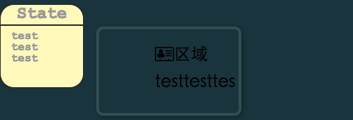

##Build Setup

``` bash
# install dependencies
npm install

# serve with hot reload at localhost:8080
npm run dev

# build for production with minification
npm run build
```
##总结
###SideBar
在具有变动DOM大小的需求中，应该使用absolute,因为正常文档流中如果取整数，很容易多／少1px,将元素挤下去。(这里仍旧使用static,float,但采用小数（最好别这样），唉）

absolute元素若果没有非static元素的限制，起点会以body为基准，但**height：100%会以视口window为基准。除非给body加上非static的属性声明.

###Search


###List

margin，width 是同级的，也就是说margin会在width=100%上给元素叠加，超出的部分默认overflow

父元素width就会对子元素约束，并且子元素不会撑开父元素。
否则，父元素大小由子元素确定.

overflow:hidden 常配合 父元素的 固定宽高使用。

###SVG

SVG 适合于直接 px 布局，结合 scalable;
它本身不是面向width=*%的，而且也只会去第一次转化的px为其大小.

普通元素自适应百分比布局倒挺好的。


svg 默认 类似于 inline-block; 但是若想和他一行，应该使用float(如果使用inline-block, 会有高度差)




SVG的g/内部标签不支持

droppable，SVG不支持拖入SVG的事件触发，例如drop不会被触发.


###Vue class
父组件中暴露的字组件的class=sketch, 如果父组件也对sketch进行了定义，那么它的亲儿子元素sketch会叠加。
而亲儿子元素内部的sketch不会受到影响。(子组件不受它爷爷，老爷影响，但受他爸)

组件间 彼此通讯的数据 越少越精剪越好。

###modules.exports export export default
ES6 会将export export default 一起包装为{ **:**, default:**},
然后赋给modules.export, 再通过require导入.

也就是说ES6只用export，而webpack new webpack.ProvidePlugin() 是import * as "what?", 所以default是在一个“what？”对象中。

因此，要么用module.exports导，要么手动import {default} as ?. 而上面那个插件只能用module.exports格式了。

###transform
css3 transform 与 svg transform 不同。

g标签可以设置css3 transform, 但会使svg  transform失效。

###z-index
SVG内部元素不识别z-index, 谁（e.g g标签)挂载在最后，谁就显示在最上面.

##总结
综上SVG包含css2基本属性／css3, 但与css3属性重名者，svg属性实效。所以svg尽量不要使用css设置（那是css3),直接食用库来操作SVG内部元素。

> !!{}
> true
> if ({}) {console.log('ok')}
> ok}


